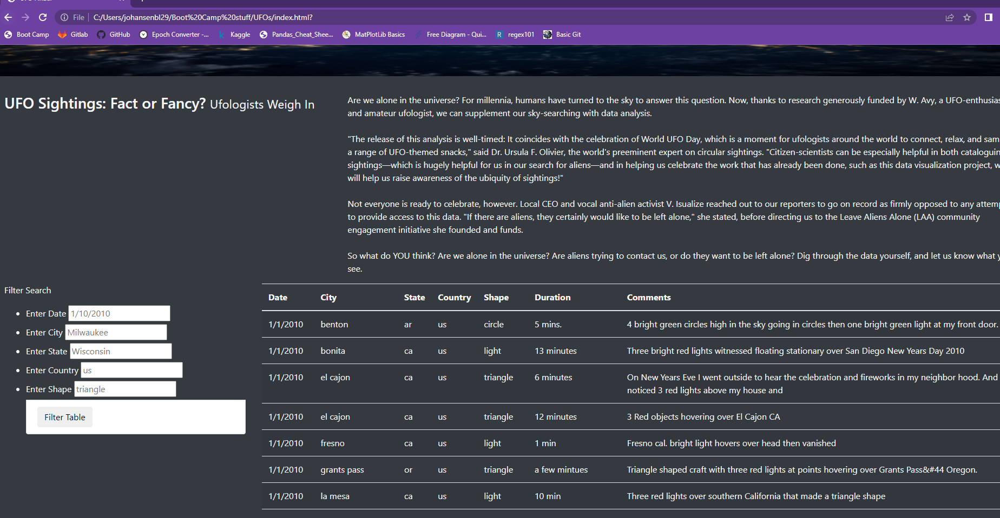
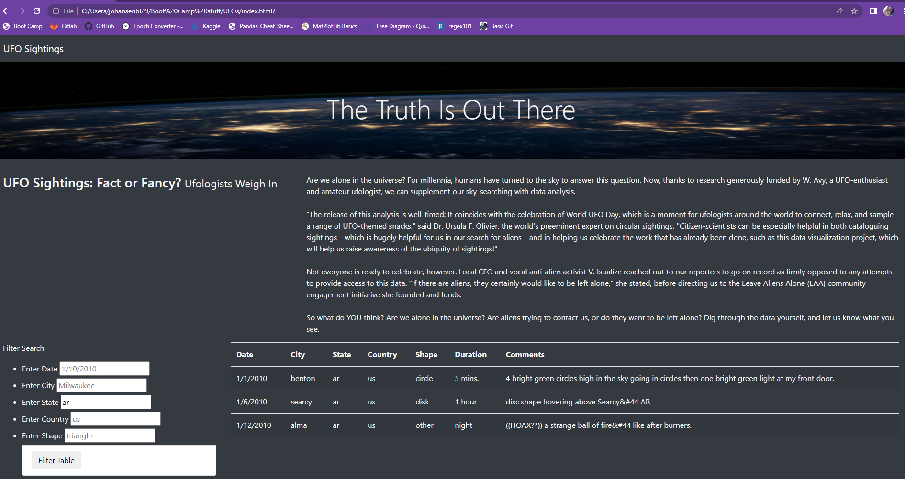

# UFOs- Searching for Truth 
An web page featuring a dynamic table was created on behalf of client Dana in order to allow end users to view refined sets of UFO sighting data based on filters around a variety of criteria. 

## Usage
End users may view the full, unfiltered data set by leaving the filters blank, as below.

Or, the user may enter a set of criteria through which to narrow the view, as below.

End users may filter their searches within the following parameters:
- Date of sighting
- City of sighting
- State of sighting
- Country of sighting
- Shape of UFO reported

## Further Suggestions
For future work, it may be helpful to improve user experience of the web site by limiting the way in which text can be input into the filter boxes, by creating a sorting button for the filtered table shown, and by creating a top 10 featured list on the side navigation bar. Each of these will help to both limit potential user errors (i.e. typing in "Wisconsin" instead of "wi"), and to help users have a better understanding of potential data that may be shown. As of now, if anything is entered into a filter table, the search function is unable to refine through any sort of text or pattern recognition, so only an exact match will show responses.

A further improvement could include a map, featuring reported locations. 
